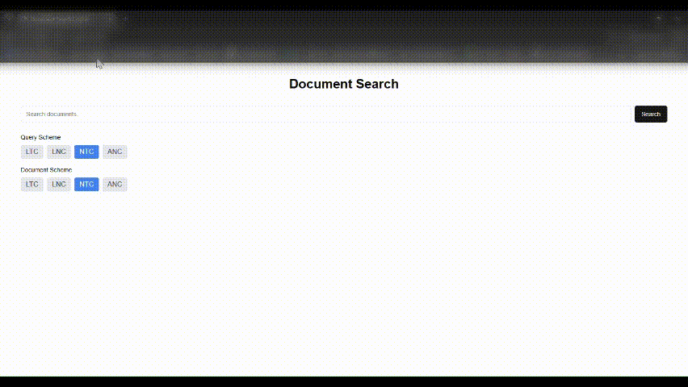
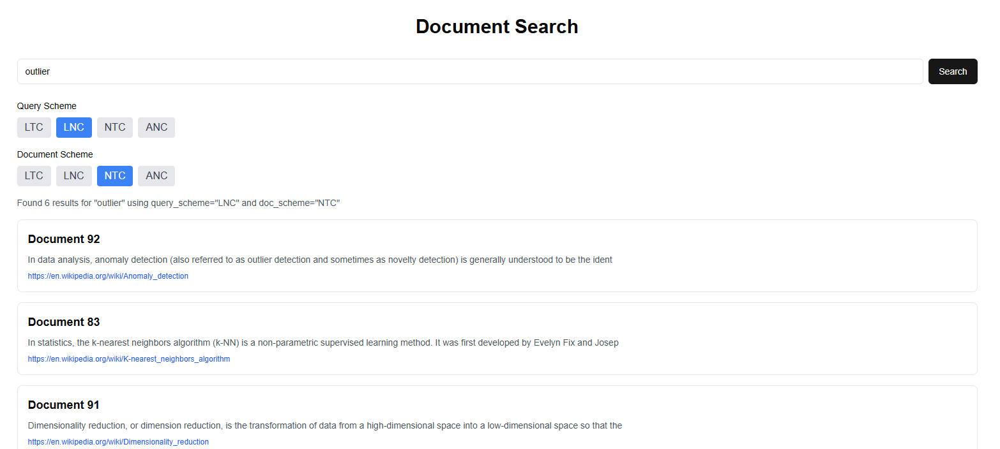

# Project Documentation: Wikipedia-Based TF-IDF Search Engine

This project implements a simple search engine over a collection of Wikipedia articles. It consists of two main components:

1. **Backend**: A [FastAPI](https://fastapi.tiangolo.com/) service that processes queries, computes TF-IDF scores, and returns ranked search results.
2. **Frontend**: A [Next.js](https://nextjs.org/) web application that provides a simple UI for users to enter their query and see the search results.

---

## Mini Demo Video

Here is a short demo showcasing how the search engine works in real-time. You can see the process of entering a query, selecting query and document schemes, and viewing the results:



The folder structure looks like this
The folder structure looks like this:

```
├── backend
│   ├── app.py
│   ├── articles.json
│   ├── create_inverted_index.py
│   ├── preprocess_articles.py
│   ├── inverted_index.json
│   └── ...
└── frontend
    ├── app
    │    ├── components
    │    │    ├── SearchBar.tsx
    │    │    ├── SearchResults.tsx
    │    │    └─
    │    ├── actions.ts
    │    ├── page.tsx
    │    └─
    └─
```

---

## 1. How the Search Engine Works

Below is a high-level overview of the steps taken to process a search query:

1. **Load Data**\
   On startup, the backend loads:

   - A list of articles from `articles.json`.
   - A pre-built inverted index from `inverted_index.json`, which initially contains raw term frequencies for each token and document.

2. **Preprocessing Steps**\
   To build the inverted index, the following preprocessing steps are applied to each document:

   - **Cleaning Text**: Removes punctuation, numbers, newlines, underscores, parentheses (and their content), lone characters, and extra spaces. The text is also lowercased.
   - **Stopword Removal**: Filters out common stopwords using NLTK’s English stopwords list.
   - **POS Tagging**: Tags tokens with their parts of speech using NLTK.
   - **Lemmatization**: Lemmatizes tokens based on their POS tags to reduce words to their base forms (e.g., "running" → "run").

3. **Build Inverted Index**\
   After preprocessing, the inverted index is constructed by:

   - Iterating over each document and token.
   - Storing the frequency of each token in each document.

   The resulting inverted index is saved to `inverted_index.json` for use during query processing.

4. **Compute IDF and Build TF-IDF Index**\
   The backend converts the raw term frequencies in the inverted index into TF-IDF values:
   
   $$\text{tf-idf}(t, d) = \left(1 + \log(\text{tf}_{t,d})\right) \times \log\left(\frac{N}{\text{df}_t}\right)$$
   
   where:

   - $\text{tf}_{t,d}$ is the number of times term \(t\) appears in document \(d\).
   - $\text{N}$ is the total number of documents.
   - $\text{df}_t$ is the number of documents that contain term \(t\).

   The backend also computes the **document norms** (the denominator for cosine normalization), which is:

   $$\|d\| = \sqrt{\sum_{t} \left(\text{tf-idf}(t, d)\right)^2}$$

5. **Query Processing**\
   When a user issues a query (e.g., “outlier”), the backend does the following:

   1. **Clean and tokenize** the query (lowercase, remove punctuation, remove stopwords).

   2. **Part-of-speech tag** and **lemmatize** tokens.

   3. **Compute query vector** using a chosen [SMART weighting scheme](http://informationretrieval.org/SMART.html) (e.g., ltc, lnc, ntc, anc).

   > **Note**: SMART stands for *Salton’s Magical Automatic Retriever of Text*, and the letters (e.g., ltc, lnc) define how **term frequency** (TF), **inverse document frequency** (IDF), and **normalization** are computed.

6. **Cosine Similarity**\
   Once the query vector is computed, each document vector (from the TF-IDF index) is compared via **cosine similarity**:

   $$\text{score}(d, q) = \frac{\sum_{t \in q \cap d} \left(\text{tf-idf}(t, q)\right) \cdot \left(\text{tf-idf}(t, d)\right)}{\|q\| \cdot \|d\|}$$

   - $\text{tf-idf}(t, q)$ is the query’s weight for term \(t\).
   - $\text{tf-idf}(t, d)$ is the document’s weight for term \(t\).

   Finally, the results are sorted in descending order of their similarity scores and returned to the frontend.

---

## 2. Screenshot of the UI

Below is a screenshot of the frontend showing a search for the keyword **“outlier.”** The left side indicates the query scheme (`LNC`) and the right side indicates the document scheme (`NTC`), along with the search results:




---

## 3. Backend: FastAPI Endpoints

The key endpoints in `app.py` are:

1. **Root (`/`)**\
   Simple health check endpoint that returns a message indicating the service is ready.

2. **Search (`/search`)**

   - **Parameters**:
     - `query` (string): The user’s search query.
     - `query_scheme` (string): The SMART scheme for the query (e.g., *ltc, lnc, ntc, anc*).
     - `doc_scheme` (string): The SMART scheme for the documents.
     - `top_k` (int): The number of top results to return.
   - **Process**:
     1. Cleans, tokenizes, and lemmatizes the query.
     2. Computes a weighted query vector.
     3. Computes cosine similarity with each document’s vector.
     4. Returns the top `k` documents with their scores, URLs, and a content snippet.

3. **Document Detail (`/doc/{doc_num}`)**

   - Returns the full content of the document specified by its document number.

### Example Request

```
GET /search?query=outlier&query_scheme=lnc&doc_scheme=ntc&top_k=5
```

### Example Response (JSON)

```json
{
  "query": "outlier",
  "tokens": {
    "outlier": 1.2346859743215286
  },
  "results_count": 6,
  "top_results": [
    {
      "doc_number": "92",
      "score": 0.10847996245022716,
      "url": "https://en.wikipedia.org/wiki/Anomaly_detection",
      "snippet": "In data analysis, anomaly detection (also referred to as outlier detection and sometimes as novelty detection) is generally understood to be the ident"
    },
        ...
    ]
}
```

---

## 4. Frontend: Next.js

The frontend application, built with Next.js, handles user interaction and displays the search results. Below is a breakdown of its components:

### Key Components

1. **SearchBar Component**
   - Provides the user interface for entering a search query.
   - Allows users to select the query scheme and document scheme via button groups.
   - On submission, navigates to the results page with query parameters.

  

2. **SearchResults Component**
   - Displays the results fetched from the backend.
   - Each result includes a title, snippet, and a link to the full document.

  

3. **Home Page**
   - Combines the SearchBar and SearchResults components into the main page layout.

   

---

## 5. TF-IDF and SMART Schemes

### TF Computation

- **Logarithmic TF**: $\text{tf}(t, d) = 1 + \log(\text{tf}_{t, d})$
- **Natural TF**:$\text{tf}(t, d) = \text{tf}_{t, d}$
- **Augmented TF**: $\text{tf}(t, d) = 0.5 + 0.5 \times \frac{\text{tf}_{t, d}}{\max(\text{tf}_{x, d})}$

### IDF Computation

- **idf**: $\text{idf}(t) = \log\left(\frac{N}{\text{df}_t}\right)$
- **prob\_idf** (not shown in the code but sometimes used): $\log\left(\frac{N - \text{df}_t}{\text{df}_t}\right)$

### Normalization

- **Cosine Normalization**:

  $$\text{normalized\_weight}(t, d) = \frac{\text{weight}(t, d)}{\sqrt{\sum_{t} \left(\text{weight}(t, d)\right)^2}}$$

### Examples of SMART Notations

- **ltc**:
  - **l** (logarithmic TF),
  - **t** (idf),
  - **c** (cosine normalization)
- **lnc**:
  - **l** (logarithmic TF),
  - **n** (no idf),
  - **c** (cosine normalization)
- **ntc**:
  - **n** (natural TF),
  - **t** (idf),
  - **c** (cosine normalization)
- **anc**:
  - **a** (augmented TF),
  - **n** (no idf),
  - **c** (cosine normalization)

---

## 6. Getting Started

1. **Backend Getting Started** 
    
    Follow the getting started of the backend project. 

   By default, the app will be available at [http://127.0.0.1:8000](http://127.0.0.1:8000).

4. **Run the Frontend**:
    Follow the getting started of the frontend project. 

   Then open [http://localhost:3000](http://localhost:3000) in your browser to see the UI.

---

## 7. Conclusion

With this setup, you have a working example of a TF-IDF–based search engine in FastAPI plus a Next.js frontend that provides an interface for users to issue queries. The system supports various SMART weighting schemes, includes lemmatization and POS-tagging, and uses cosine similarity for ranking.

Feel free to extend this project by adding:

- More advanced ranking features (like phrase matching or query expansion).
- Additional UI features (like highlighting query terms in snippets).
- Authentication or user-specific settings.

Happy coding!

